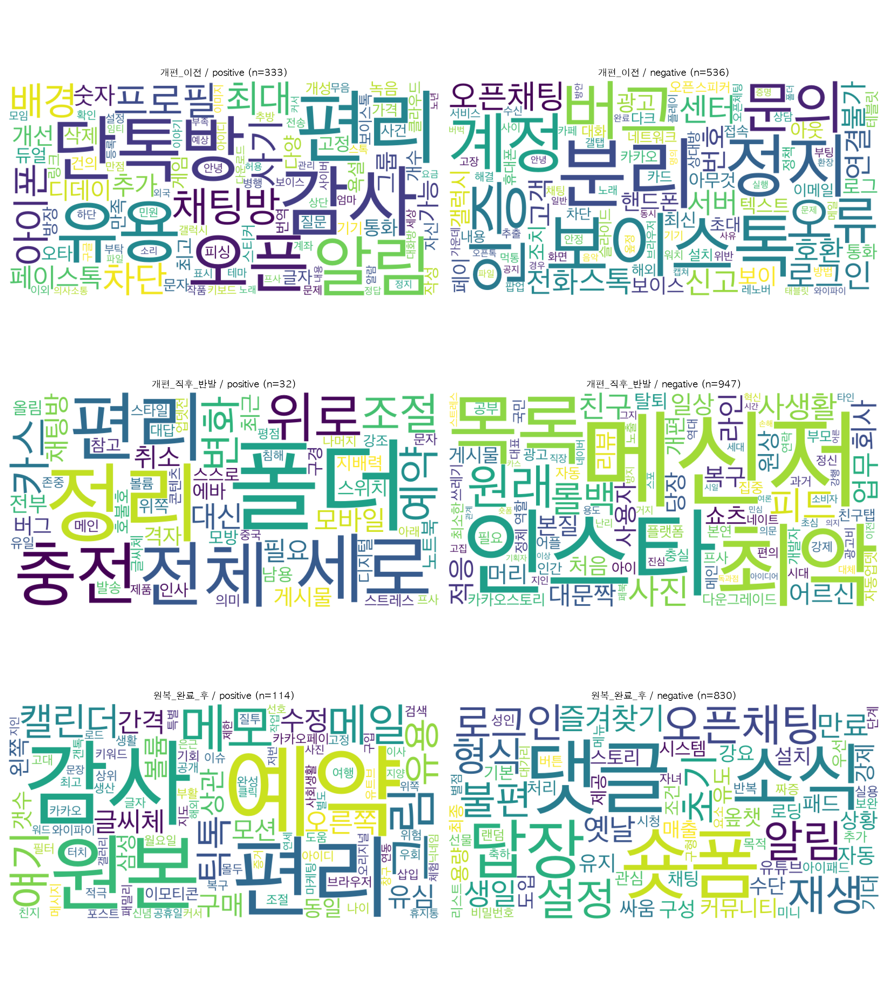

# 2주차 DE 4조 Team Wiki 

- 일정: 2026. 07. 06 ~ 2026. 07. 09.
- 조원: 이동찬, 박민서, 김민수, 최지욱

- [W2M5 소스 코드로 이동](./W2M5_team_activity.ipynb)

---

 W2M5 - Sentiment Analysis

## 1. 아이디어 브레인스토밍

프로젝트를 시작하기 전 여러 아이디어를 검토한 뒤, 실제 서비스에서 활용 가능성이 높은 주제를 선정했다.

| 데이터셋 | 아이디어 | 고객 | 선택하지 않은 이유 |
|---|---|---|---|
| 월드컵 한국전 하이라이트 유튜브 댓글 | 선수별 긍정·부정 반응을 분석해 광고 모델 가치를 평가 | 광고 기획/마케팅팀 | 경기력 중심 댓글이 대부분이라 모델 이미지 평가에는 한계 |
| 네이버지도 음식점 리뷰 | 음식점 리뷰를 분석해 긍정·부정 요인 도출 | 소비자 | 이벤트성 리뷰가 많아 긍정 편향 가능성 |
| **Google Play 카카오톡 리뷰 (채택)** | **업데이트 전후 사용자 반응 변화를 비교** | **서비스 기획팀** | **업데이트라는 명확한 기준 시점이 있어 전후 비교가 가능** |
---

## 2. 프로젝트 목표 및 비즈니스 가치

**고객**
* 새로운 기능을 기획하려고 하는 서비스 기획팀
* 다른 회사의 예시를 바탕으로 서비스 품질을 검토하는 QA팀
* 자료를 얻고자하는 UX 리서치 조직

**판매 대상**
* 카카오톡의 대개편 업데이트로 인한 민심 변화 분석 자료

**기대 효과 (비즈니스 가치)**
* 리뷰를 개편 이전, 개편 직후, 원상복 이후 세 시기로 나누어 비교하면 어떤 이슈는 일시적인 반발이었고, 어떤 이슈는 시간이 지나도 계속 언급되는지를 확인할 수 있을 것이다.
* 이를 통해 서비스 기획 단계에서 과거 UI/UX 개편 사례를 참고하여 **사용자 반발 가능성이 높은 요소를 미리 검토**하고, 업데이트 이후 **어떤 기능을 우선적으로 개선해야 하는지 탐색하는 기초 자료**로 활용될 수 있을 것이다.
* 또한 서비스 기획팀과 QA팀은 시기별 워드클라우드를 통해 **사용자 관심사와 불만이 어떻게 변화했는지를 빠르게 파악**하고, UX 리서치 조직은 **반복적으로 등장하는 키워드를 중심으로 인터뷰나 추가 사용자 조사를 설계**하는 데 활용할 수 있을 것 같다.

**예상되는 한계점**
* 리뷰 작성 시점과 실제 사용 시점이 다를 수 있음
* 워드클라우드는 단어 빈도만 보여줄 뿐 원인까지 설명하지 못함
* 하나의 서비스만으로 일반화하기 어려움

---

## 3. 데이터셋 구축 (프로토타입)

### 3.1 분석 대상

카카오톡은 2025년 UI를 대규모 개편한 뒤 사용자 반발로 일부 기능을 순차적으로 원상 복구했다.

| 날짜 | 사건 |
|---|---|
| 2025-09-23 | UI 개편 |
| 2025-09-29 | 일부 기능 롤백 |
| 2025-12-15 | 친구 탭 원상 복구 |

이를 기준으로 리뷰를 세 구간으로 나누었다.

| 구간 | 기간 |
|---|---|
| 개편 이전 | 2023-01-01 ~ 2025-09-22 |
| 개편 직후 | 2025-09-23 ~ 2025-12-31 |
| 원상 복구 이후 | 2026-01-01 ~ |

### 3.2 웹 스크레이핑

Google Play 리뷰는 Selenium으로 직접 수집했다.
처음에는 최신순으로 모든 리뷰를 수집하려 했지만, 개편 이후 리뷰가 급증하면서 브라우저 메모리 한계로 중간에 중단되는 문제가 발생했다.
이를 해결하기 위해 다음과 같이 방식을 변경했다.

* 최신순 대신 관련성순으로 수집
* 리뷰 날짜를 기준으로 세 구간으로 자동 분류
* 각 구간 목표 개수를 채우면 자동 종료
* 중복 제거 및 이어받기 기능 추가

또한 폰과 태블릿 리뷰를 각각 수집하여 총 3,000건의 리뷰를 구축했다.

---

## 4. 최종 데이터셋

리뷰는 평점을 기준으로 다음과 같이 분류했다.

* 4~5점 : 긍정
* 1~2점 : 부정
* 3점 : 제외

| 구간 | 부정 | 긍정 |
|---|---|---|
| 개편 이전 | 536 | 333 |
| 개편 직후 | 947 | 32 |
| 원복 이후 | 830 | 114 |

특히, 개편 직후에는 긍정 리뷰가 32건에 불과할 정도로 부정적인 반응이 압도적으로 많았다.

---

## 5. 프로젝트 결과

리뷰를 시기별로 비교한 결과, 업데이트 이후 사용자 반응 변화를 탐색하는 데에는 일정 부분 활용 가능성을 확인할 수 있었다.

* 개편 직후에는 메신저(정체성 논란), (카톡의)인스타(화), 목록(친구목록), 롤백 등의 키워드가 크게 나타나 사용자 관심과 불만이 집중된 기능을 빠르게 확인할 수 있었다.
* 원상복구 후에는 또 다른 키워드들이 보이는 모습을 확인할 수 있어 변화를 빠르게 파악할 수 있었다. 따라서 일시적인 이슈와 시간이 지나도 계속 언급되는 이슈를 구분할 수 있었다.
* 모든 리뷰를 직접 읽지 않고도 후속 분석이 필요한 기능을 빠르게 좁혀볼 수 있었다.

반면 워드클라우드만으로는 사용자가 왜 불만을 느꼈는지까지는 설명하기 어려웠으며, 실제 개선 우선순위를 결정하기에는 한계가 있었다.

---

## 6. 한계 및 개선 방향

**한계**

* 관련성순 수집으로 인해 표본 대표성이 부족할 수 있음
* 긍정 리뷰 수가 적어 일부 워드클라우드 해석이 어려움
* 단어 빈도만으로는 불만의 원인과 중요도를 설명하기 어려움
* 별점으로 분류된 리뷰에 긍정/부정 리뷰가 섞여 있는 경우 많음
* 어플 버전을 알 수 없어 리뷰 작성 내용과 실제 사용 버전이 다를 수 있음
* 폰과 태블릿 리뷰를 함께 분석하여 기기별 특성이 일부 섞였을 가능성

**개선 방향**

* 무작위 또는 전체 리뷰 기반 샘플링으로 대표성 향상
* 딥러닝 기반 모델을 활용한 감정 분석을 통한 고도화된 분석 적용
* 평점, 설치 수, 고객센터 문의량 등 다른 지표와 함께 분석
* 하나의 리뷰 내에서도 긍정/부정 분류

---

## 7. 정리

이번 프로젝트에서는 카카오톡 UI 개편 전후의 Google Play 리뷰를 직접 수집하여 사용자 반응의 변화를 시간축으로 분석했다. 워드클라우드는 시기별 핵심 이슈를 빠르게 탐색하는 데에는 효과적이었지만, 실제 서비스 개선 의사결정에 활용하기 위해서는 대표성 있는 데이터 수집과 문맥 기반 분석, 그리고 다른 정량 지표를 함께 활용해야 한다는 점을 확인했다.

---
 W2M6 - Docker 이미지를 AWS EC2에 배포하기

## Docker를 사용하는 이유가 뭘까요?
- 환경 일관성 확보하기 위해 사용한다. 
- "내 PC에서는 되는데 다른 PC에서는 안 된다"는 문제를 이미지 하나로 패키징해서 해결하여 누구나 동일한 조건에서 실행과 배포가 가능하다.

## 어떤 점은 더 불편한가요?
- 번거롭고 불편하다는 의견이 다수 있었다.
- 처음 익히고 연결하는 진입장벽이 크고, 디버깅이나 운영이 복잡해진다. 
- 코드를 조금만 수정해도 이미지를 다시 빌드하고 재배포해야 하는 번거로움이 생긴다. 
- AWS 연동 설정 자체도 복잡하다는 의견 있음

## 만약에 여러대의 EC2에 여러 개의 컨테이너를 배포해야 한다면 어떻게 해야 할까요?
- 오케스트레이터라는 도구를 활용하자는 의견을 모두 제시했다.
- 사람이 서버마다 일일이 실행 및 관리하는 건 비효율적이다.
- 쿠버네티스, ECS 등의 도구로 어떤 EC2에 무엇을 띄울지 자동 결정하고, 컨테이너 장애 시 자동 재시작 등을 처리한다.